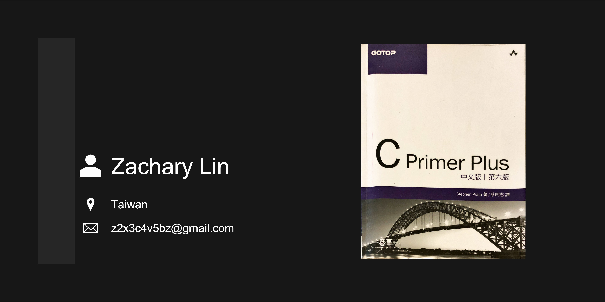

# C Primer Plus 中文版 第六版（習題個人解答） #

## Abstract ##

**Title:** C Primer Plus 中文版 第六版

**Auther:** Stephen Prata

**Translator:** 蔡明志

**Introduction:**

>- 內容淺顯易懂，教學自用兩相宜
>- 配合範例學習，可收事半功倍之效果
>- 符合 ANSI C 語法及最新 C11 標準，於移植性（Protable）上完全沒問題
>- 提供豐富多元的問答題，測驗讀者對各章節的了解程度
>- 附有程式設計練習題，增進撰寫程式的功力

※ 習題練習的作業系統主要使用 Apple macOS Monterey，並選擇軟體 VS Code 為文字編輯器。

※ 原諒我題目內不附圖示。

※ 請留意，文中數學公式在瀏覽器頁面中可能無法正確顯示。部分內容有做修正，不另外標示提醒。

※ 圖書封面、圖書資訊、章節內容、習題皆為版權作者、出版商所有，本站所刊內容僅供教育、學習使用。

## Table of Contents ##

- [C Primer Plus 中文版 第六版（習題個人解答）](#c-primer-plus-中文版-第六版習題個人解答)
  - [Abstract](#abstract)
  - [Table of Contents](#table-of-contents)

## Chapter 01 -- 準備開始 ##

>- C 語言的歷史和特徵
>- 撰寫程式需要的步驟
>- 有關編譯器和連結器
>- C 語言標準

## Chapter 02 -- C 語言簡介 ##

>- 運算子：`=`
>- 函數：`main()`、`printf()`
>- 一個簡單的 C 程式範例
>- 建立一整數值的變數，然後指定值，並將它這些值顯示於螢幕
>- 換行的字元
>- 在程式中撰寫註解敘述、建立包含一個以上函數的程式，與尋找程式錯誤所在
>- 何謂關鍵字

## Chapter 03 -- 資料和 C ##

>- 關鍵字：`int`、`short`、`long`、`unsigned`、`char`、`float`、`double`、`Bool`、`Complex`、`Imaginary`
>- 運算子：`sizeof`
>- 函數：`scanf()`
>- C 使用的基本資料型態
>- 整數型態與浮點數型態之差異
>- 撰寫常數和宣告變數型態
>- 如何使用 `printf()` 和 `scanf()` 以輸出和讀取不同型態的值

## Chapter 04 -- 字典及格式化輸入／輸出 ##

>- 函數：`strlen()`
>- 關鍵字：`const`
>- 字串
>- 字串如何建立與儲存
>- 如何使用 `scanf()` 與 `printf()` 函數來讀取與顯示字串
>- 如何使用 `strlen()` 函數計算字串的長度
>- C 的前置處理指令 `#define` 與 ANSI C 的 `const` 修飾字元用來建立符號常數

## Chapter 05 -- 運算子、運算式及敘述 ##

>- 關鍵字：`while`、`typedef`
>- 運算子：`= - * /`、`% ++ -- (type)`
>- 用於算術運算的一些基本運算子
>- 運算子的運算優先順序與敘述和運算式的含義
>- 便利的 `while` 迴圈
>- 複合運算敘述、自動型態轉換，以及轉型
>- 如何撰寫帶有參數的函數

## Chapter 06 -- C 的控制敘述：迴圈 ##

>- 關鍵字：`for`、`while`、`do while`
>- 運算子：`< > >= <= != == += *= -= /= %=`
>- 函數：`fabs()`
>- C 的三種迴圈架構：`while`、`for`、以及 `do while`
>- 使用關係運算子建造控制迴圈的運算式
>- 其他運算子
>- 經常使用於迴圈的陣列
>- 撰寫有回傳值的函數

## Chapter 07 -- C 的控制敘述：分支和跳躍 ##

>- 關鍵字：`if`、`else`、`switch`、`continue`、`break`、`case`、`default`、`goto`
>- 運算子：`&& || ?:`
>- 函數：`getchar()`、`putchar()` 以及 `ctype.h` 家族
>- 如何使用 `if` 與 `if else` 敘述，以及巢狀的 `if`
>- C 的條件運算子
>- `switch` 敘述
>- `break`、`continue` 以及 `goto` 敘述
>- 使用 C 的字元 I/O 函數：`getchar()` 與 `putchar()`
>- `ctype.h` 標頭檔提供字元分析函數

## Chapter 08 -- 字元輸入／輸出和輸入確認 ##

>- 更多輸入與輸出相關的，以及緩衝區與無緩衝區的輸入
>- 如何從鍵盤模擬檔案結束的狀況
>- 如何使用重導將檔案和程式連接起來
>- 讓使用者介面更友善

## Chapter 09 -- 函數 ##

>- 關鍵字：`return`
>- 運算子：`*`（單元運算子）、`&`（單元運算子）
>- 函數及如何定義
>- 如何使用參數及回傳值
>- 如何使用指標變數及函數參數
>- 函數型態
>- ANSI C 原型宣告
>- 遞迴

## Chapter 10 -- 陣列與指標 ##

>- 關鍵字：`static`
>- 運算子：`& * (unary)`
>- 如何建立與初始化陣列
>- 指標與陣列的關係
>- 撰寫處理陣列的函數
>- 二維陣列

## Chapter 11 -- 字串與字串函數 ##

>- 函數：`gets()`、`gets_s()`、`fgets()`、`puts()`、`fputs()`、`strcat()`、`strncat()`、`strcmp()`、`strncmp()`、`strcpy()`、`strncpy()`、`sprintf()`、`strchr()`
>- 建立與使用字串
>- 從 C 函數庫使用一些有關字串和字元函數，而且也可以建立自己撰寫的函數
>- 使用命令列引數

## Chapter 12 -- 儲存類別、連結和記憶體管理 ##

>- 關鍵字：`auto`、`extern`、`static`、`register`、`const`、`volatile`、`restricted`、`_Thread_local`、`_Atomic`
>- 函數：`rand()`、`srand()`、`time()`、`malloc()`、`calloc()`、`free()`
>- C 如何允許您決定變數的有效範圍，以及變數的生命週期
>- 設計更複雜的程式

## Chapter 13 -- 檔案的輸入與輸出 ##

>- 函數：`fopen()`、`getc()`、`putc()`、`exit()`、`fclose()`、`fprintf()`、`fscanf()`、`fgets()`、`fputs()`、`rewind()`、`fseek()`、`ftell()`、`fflush()`、`fgetpos()`、`fsetpos()`、`feof()`、`ferror()`、`ungetc()`、`setvbuf()`、`fread()`、`fwrite()`
>- 如何使用 C 的標準 I/O 的家族函式來處理檔案
>- 文字模式與二進位模式、文字與二進位格式，以及有緩衝區與沒有緩衝區的 I/O
>- 使用可以循序與隨機存取檔案的函式

## Chapter 14 -- 結構與其他資料形式 ##

>- 關鍵字：`struct`、`union`、`typedef`
>- 運算子：`. ->`
>- C 的結構是什麼？如何建立結構樣板和變數？
>- 如何存取結構的成員，以及如何撰寫處理結構的函數
>- C 的 `typedef` 功能
>- 聯合與指向函數的指標

## Chapter 15 -- 位元運算 ##

>- 運算子：`~ & | ^`、`>> <<`、`&= |= ^= >>= <<=`
>- 二進位、八進位，以及十六進位數字標記（複習）
>- 兩個 C 語言機制用以處理個別的位元：位元運算子與位元欄位

## Chapter 16 -- C 的前置處理器和函式庫 ##

>- 前置處理器的指令：`#define`、`#include`、`#ifdef`、`#else`、`#endif`、`#ifndef`、`#if`、`#elif`、`#line`、`#error`、`#pragma`
>- 函數／巨集指令：`sqrt()`、`atan()`、`atan2()`、`exit()`、`atexit()`、`assert()`、`memcpy()`、`memmove()`、`va_start()`、`va_arg()`、`va_copy()`、`va_end()`
>- 更多 C 語言的前置處理器指令
>- 像函數的巨集與條件式的編譯
>- 通用選擇運算式
>- 內聯函數
>- C 函式庫與一些特定函數

## Chapter 17 -- 進階資料表示方式 ##

>- 函數：`malloc()`
>- 使用 C 表示不同的資料型態
>- 新的演算法與增加發展程式的能力
>- 抽象的資料型態
